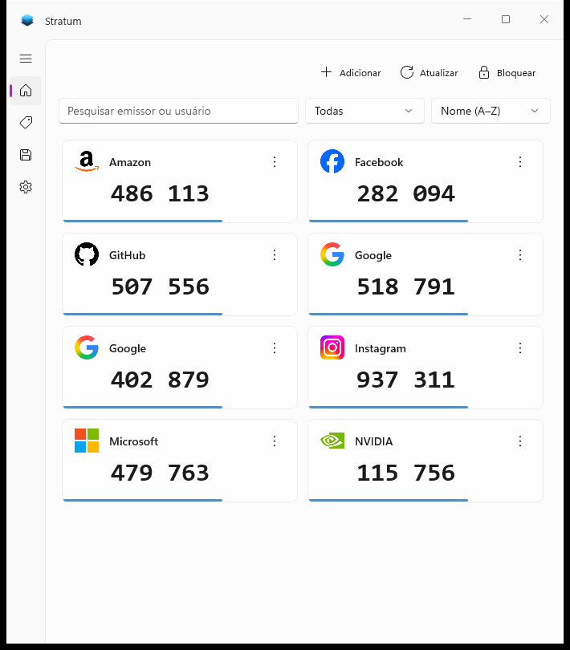
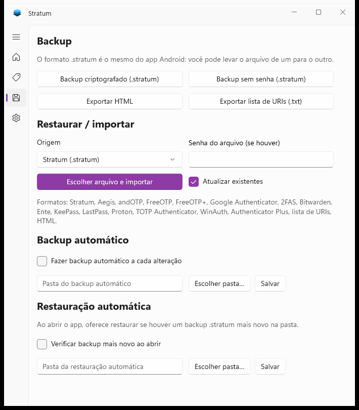

# Stratum para Windows

Um app gratuito e de código aberto de autenticação de dois fatores para **Windows 10/11**, com interface WinUI 3. Traz o mesmo núcleo do [Stratum para Android](https://github.com/stratumauth/app): backups criptografados, ícones, categorias e alto nível de personalização — com banco de dados e arquivos de backup **intercambiáveis** entre as duas plataformas.

Suporta autenticadores TOTP (por tempo) e HOTP (por contador) com SHA1, SHA256 ou SHA512, além de Mobile-Otp (mOTP), Steam e Yandex.

## Download e execução ⬇️

Versão atual: **1.0.0** — instalador **MSIX** (tipo Windows Store) com cert self-signed, além do exe autocontido.

### 1. Instalador MSIX (recomendado) 🛍️

```powershell
# gera Stratum.Windows/AppPackages/...\Stratum.Windows_1.0.0.0_x64.msix
# (cria o cert CN=Stratum, confia no store, publica e assina)
powershell -ExecutionPolicy Bypass -File Stratum.Windows/publish-msix.ps1

# instala (ou dê duplo clique no .msix via App Installer)
Add-AppxPackage .\Stratum.Windows\AppPackages\Stratum.Windows_1.0.0.0_x64_Test\Stratum.Windows_1.0.0.0_x64.msix
```

O app aparece no Menu Iniciar como **Stratum**. O certificado só precisa ser confiado uma vez por máquina (o script faz isso automaticamente).

### 2. Exe autocontido (unpackaged)

```powershell
# compilar
dotnet build Stratum.Windows/Stratum.Windows.csproj -c Release -p:Platform=x64

# publicar o exe autocontido (pasta publish-win64/Stratum.exe)
dotnet publish Stratum.Windows/Stratum.Windows.csproj -c Release -r win-x64 --self-contained
```

Requisitos: Windows 10 versão 1809 (build 17763) ou superior / Windows 11, .NET 10 incluído no pacote (self-contained).

> Para distribuir, copie a pasta publicada inteira — o `Stratum.exe` sozinho não funciona.

## Funcionalidades 🪄

⚙️ **Compatibilidade:** funciona com a maioria dos provedores e contas, e lê os mesmos arquivos do app Android (`.db3` e `.stratum`).

💾 **Backup / Restore:** backups `.stratum` com criptografia forte (Argon2id + AES-GCM), backup sem senha, exportação em HTML e lista de URIs. Importa de Aegis, andOTP, FreeOTP(+), Google Authenticator, 2FAS, Bitwarden, Ente, KeePass, LastPass, Proton, TOTP Authenticator, WinAuth, Authenticator Plus, lista de URIs e HTML. Backup automático a cada alteração e restauração automática de pasta.

🌙 **Temas e materiais:** claro, escuro ou sistema, com fundos Mica, Acrílico (transparente) ou sólido — incluindo title bar integrada.

⏺️ **Ícones:** o mesmo pack de 700+ logos do Android, com variantes para tema escuro, além de ícones personalizados por imagem.

📂 **Categorias:** organize, filtre, defina categoria padrão e reordene.

🔒 **Banco protegido:** senha com SQLCipher, bloqueio automático por inatividade, desbloqueio com Windows Hello e instância única.

🎨 **Personalização:** 3 modos de exibição (Padrão, Compacto, Ladrilhos), 5 ordenações com ordem manual por arrasto, agrupamento de dígitos, tap-to-copy / tap-to-reveal, esconder nomes de usuário, minimizar para a bandeja.

## Screenshots 📱




## Dados e compatibilidade 💾

* Banco de dados em `%LocalAppData%\Stratum\authenticator.db3` (SQLCipher — o mesmo arquivo abre no Android e vice-versa).
* Configurações em `%LocalAppData%\Stratum\settings.json`, logs em `%LocalAppData%\Stratum\logs`.
* Formato do backup: [doc/BACKUP_FORMAT.md](./doc/BACKUP_FORMAT.md).

## Desenvolvimento 🛠️

Pré-requisitos: .NET 10 SDK (ou Visual Studio 2022 17.12+). Sem workloads extras — tudo via NuGet. Veja o [guia de contribuição](./CONTRIBUTING.md).

```powershell
dotnet build Stratum.Windows/Stratum.Windows.csproj -c Debug -p:Platform=x64
dotnet test Stratum.Test/Stratum.Test.csproj -c Debug
```

Estrutura: `Stratum.Core/` (núcleo compartilhado), `Stratum.Windows/` (app WinUI 3), `Stratum.Windows.Tray/` (ícone da bandeja), `Stratum.Test/` (testes xUnit), `icons/` (pack de logos).

## Créditos ❤️

Este app é construído sobre o núcleo do **[Stratum para Android](https://github.com/stratumauth/app)**, criado por **jamiemh** — todo o crédito pela criptografia, formato de backup, conversores e pack de ícones vai para o projeto original.

Se quiser apoiar o desenvolvimento do projeto original: [Buy Me a Coffee](https://www.buymeacoffee.com/jamiemh).

## Licença

GPL-3.0-only — veja [LICENSE](./LICENSE). Este programa é distribuído SEM NENHUMA GARANTIA, sem nem mesmo a garantia implícita de COMERCIALIZAÇÃO ou ADEQUAÇÃO A UM PROPÓSITO ESPECÍFICO.
